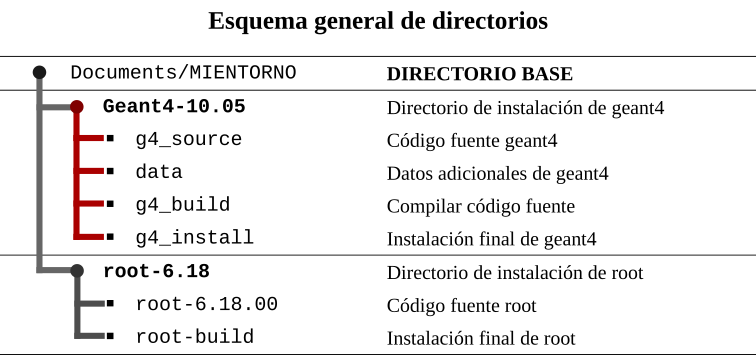
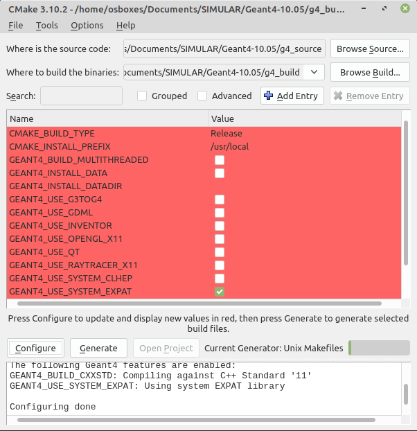
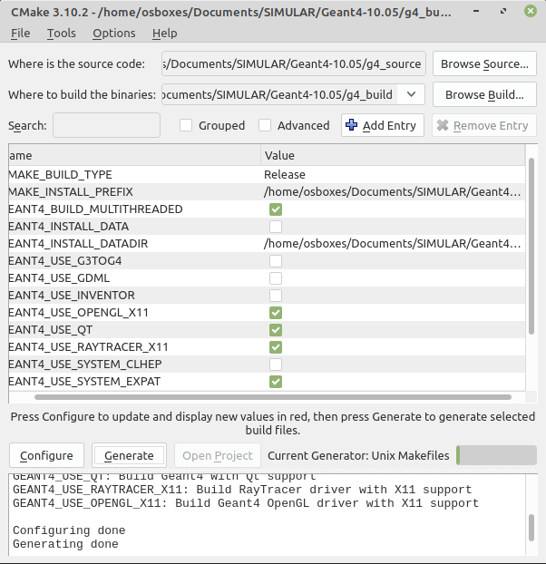
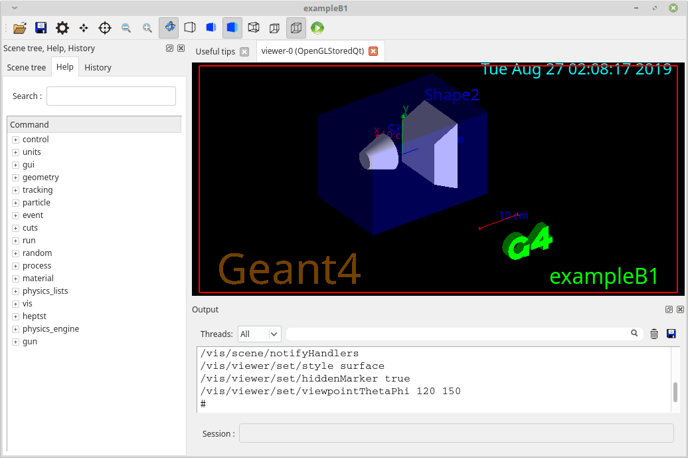

# Instalación de Geant4 10.05.p01

## Instalación desde el código fuente

La instalación final seguirá el siguiente esquema de directorios:




1. Descargar el código fuente desde la página oficial de [Geant4](http://geant4.web.cern.ch/)

   Decargar la última versión estable: [Geant4 10.05.p01](http://geant4.web.cern.ch/support/download)

2. **Descargar** los 12 ***paquetes adicionales*** de la sección: *DATA FILES ( )*.

   Son necesarios para ejecutar los ejemplos que trae Geant4.  Son en total 12 archivos: G4NDL4.5, G4EMLOW7.7, G4PhotonEvaporation5.3, etc., (Aproximadamente 2.1 GB) se puede omitir este paso si se posee una conexión a Internet muy estable en latencia además velocidad de descarga.

3. **Descomprimir** el código fuente y renombrar la carpeta de la siguiente forma:

   *geant4.10.05.p01* --- a ---> *g4_source*

4. Prestar atención al esquema de instalación.

   Puedes cambiar libremente el nombre del directorio base, aquí: **SIMULAR**

5. **Mover** la carpeta **g4_source** a la ruta de instalación: 

   ```bash
   /home/USUARIO/Documents/SIMULAR/Geant4-10.05/
   ```

6. **Descomprimir** los archivos adicionales dentro de una carpeta denominada: **data**

7. **Mover** la carpeta **data** a la ruta de instalación:

   ```bash
   /home/USUARIO/Documents/SIMULAR/Geant4-10.05/
   ```

8. Dentro de la ruta de instalación crear dos directorios adicionales:

   * **geant_build**
   * **geant_install**

9. En este punto debemos tener el siguiente lo siguiente:

   ```bash
   $ ls
   ```

   ```bash
   output:
   data  g4_build  g4_install  g4_source  geant4.10.05.p01.tar.gz
   ```

10. Configurar `cmake`. Utilizaremos el modo gráfico:

    ```bash
    $ cmake-gui
    ```

    En la interfaz seleccionar lo siguiente:

    * Source code  = /home/USUARIO/Documents/SIMULAR/Geant4/g4_source

    * Build binaries  = /home/USUARIO/Documents/SIMULAR/Geant4/g4_build

    * Clic en *configurar*

    * Clic en *finish*

      

11. Activar características de Geant4 (según se requiera)

    Recomiendo instalar las siguientes opciones, son útiles en la mayoría de situaciones, sin embargo, depende de la finalidad del usuario, los detalles se pueden ver en [aquí](http://geant4-userdoc.web.cern.ch/geant4-userdoc/UsersGuides/InstallationGuide/html/installguide.html)

    - [x] MAKE_INSTALL_PREFIX =  /home/USUARIO/Documents/SIMULAR/Geant4/g4_build
    - [x] GEANT4_BUILD_MULTITHREADED
    - [x] GEANT4_INSTALL_DATA
    - [x] GEANT4_INSTALL_DATADIR = /home/USUARIO/Documents/SIMULAR/Geant4/data
    - [x] GEANT4_USE_OPENGL_X11
    - [x] GEANT4_USE_QT
    - [x] GEANT4_USE_RAYTRACER_X11
    - [x] GEANT4_USE_SYSTEM_EXPAT

    

12. Clic en ***Configure*** dos veces si fuera necesario (no se debe ver marcadores rojos)

13. Clic en ***Generate*** y cerrar cmake.

    | cmake                   | cmake + características |
    | ----------------------- | ----------------------- |
    |  |  |

14. Abrir una terminal en el directorio g4_build

    ```bash
    $ cd /home/USUARIO/Documents/SIMULAR/Geant4-10.05/g4_build/
    ```

15. Compilar

    ```bash
    $ make -j4
    ```

    Aquí `j4` indica el número de núcleos que asignaremos a la tarea. A mayor cantidad de núcleos menor tiempo en realizar la tarea y viceversa. Depende de tu ordenador. Este proceso puede tomar 2 horas o más.

    

    

16. Instalar Geant4

    ```bash
    $ make install
    ```

17. Fijar al variables de entorno (temporal)

    Esto método se tiene que hacer cada vez que se cierre la terminal. Caso contrario, se tiene que fijar las variables de forma persistente (recomendado).

    ```bash
    $ source /home/USUARIO/Documents/SIMULAR/Geant4-10.05/g4_install/bin/geant4.sh
    ```

    O entrar al directorio de instalación dentro de la carpeta **bin**

    ```bash
    $ source geant4.sh
    ```

18. Listo! Geant4 esta correctamente instalado.


## Configurar entorno de variables (persitente)

El proceso es el siguiente:

- Abrir el directorio home: */home/*USUARIO/

- Presionar `Crtl + H` para ver los archivos ocultos.

- Localizar el archivo `.bashrc`

- Abrir `.bashrc` con un editor de texto, ir al final del todo y pegar lo siguiente:

  (Cambia USUARIO por el tuyo)

  ```bash
  # Entorno de Geant4 y ROOT
  source /home/USUARIO/Documents/SIMULAR/Geant4-10.05/g4_install/bin/geant4.sh
  ```

- Guardamos, salimos y presionar nuevamente `Crtl + H` para regresar todo a la normalidad.

- Ahora se puede ejecutar *geant4* desde cualquier parte del ordenador cuando se necesite.


## Ejecutar una simulación

1. **Crear un directorio de trabajo** dentro del directorio base

   ```bash
   $ cd /home/USUARIO/Documents/SIMULAR/
   $ makdir g4_work
   ```

2. **Copiar un ejemplo** de Geant4 en el directorio de trabajo

   Los ejemplos se encuentran en: 

   ```bash
   /home/USUARIO/Documents/SIMULAR/geant4-10.5.1/g4_install/share/Geant4-10.5.1/examples/
   ```

3. En mi caso he copiado el ejemplo: **/Basic/B1**

4. Dentro del directorio del ejemplo hacemos lo siguiente:

   ```bash
   $ mkdir build
   $ cd build
   ```

5. Construimos el paquete con `cmake`

   ```bash
   $ camke ../
   ```

6. Compilar

   ```bash
   $ make -j2
   ```

7. Listar los objetos del directorio y debemos ver un ejecutable

   ```bash
   $ ls
   ```

   ```bash
   output:
   CMakeCache.txt  cmake_install.cmake  exampleB1.in   G4History.macro  Makefile run2.mac
   CMakeFiles      exampleB1            exampleB1.out  init_vis.mac     run1.mac  vis.mac
   ```

8. Ejecutar la simulación

   ```bash
   $ ./exampleB1
   ```

   

## Resultado




# Recursos

* [Página oficial Geant4](http://geant4.web.cern.ch/)
* [Guía oficial de instalación](https://indico.cern.ch/event/679723/contributions/2792554/attachments/1559217/2453759/Geant4InstallationGuide.pdf)