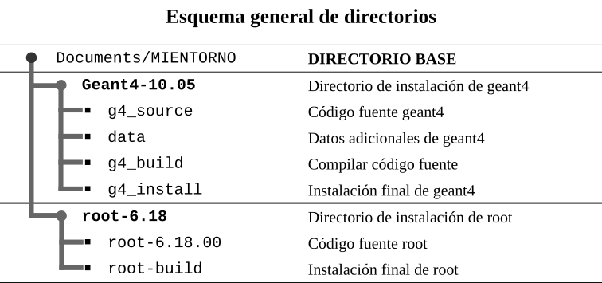
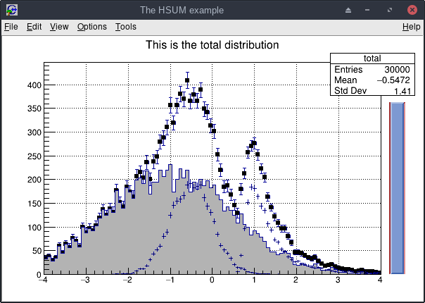

# Instalación completa de Geant4 y ROOT


En este repositorio se muestra el proceso detallado para realizar una instalación completa e integrada entre Geant4 y ROOT. Se dirige a usuarios noveles y medios. El proceso funciona para las siguientes distribuciones basadas en *apt* y en *pacman*.

* **Debian (10), Ubuntu (18.04) Linux Mint (19.2)**

  Estas distribuciones hacen uso de `apt` para gestionar los paquetes. Para instalar un paquete nuevo el comando es el siguiente: 

  ```bash
  $ sudo apt install nombre_paquete
  ```

* **Manjaro (18.0.4)**

  Estas distribuciones hacen uso de `pacman` para gestionar los paquetes. Para instalar un paquete nuevo el comando es el siguiente:

  ```bash
  $ sudo pacman -S nombre_paquete
  ```

  

El esquema final de la instalación será el siguiente:





## Geant4 10.05.p01
---

Geant4 es un "toolkit" (caja de herramientas) para la simulación del paso de partículas a través de la materia. Su proceso de instalación no es trivial, fácilmente puede disuadir a usuarios poco experimentados, pero constituye un paso importante para ingresar a mundo de la simulación. El proceso de instalación que usaremos será el siguiente:

* Preparación del sistema
* Instalación para apt systems y pacman systems
* Instalación para pacman systems

### Preparación del sistema

1. ACTUALIZAR la distribución de Linux a la versión más reciente:

   ```bash
   $ sudo apt update
   ```

   ```bash
   $ sudo apt upgrade
   ```

2. INSTALAR DEPENDENCIAS

   Los paquetes han sido revisados con la base de paquetes de [Ubuntu](https://packages.ubuntu.com/).

   **Librerías necesarias para Geant4 y ROOT:**

   ```bash
   $ sudo apt install libxerces-c-dev mesa-utils mesa-utils-extra mesa-common-dev libfreetype6 libfreetype6-dev libxmu-dev qt4-default libqt4-opengl libqt4-opengl-dev qt5-default libqt5opengl5 libqt5opengl5-dev
   ```

   ```bash
   $ sudo apt install cmake cmake-qt-gui g++ gcc gfortran binutils libx11-dev libxpm-dev libxft-dev libxext-dev libpng-dev libpng++-dev libjpeg-dev
   ```

   Librerías importantes (opcionales):

   ```bash
   $ sudo apt install git libssl-dev libpcre3-dev libftgl-dev libmysqlclient-dev libfftw3-dev libcfitsio-dev graphviz-dev libavahi-compat-libdnssd-dev libldap2-dev python-dev libxml2-dev libkrb5-dev libgsl23 libgsl-dev
   ```

### Instalación Geant4

* [**Distribuciones: Debian/Ubuntu/Mint**](/Geant4/install_geant4.md)

* **Distribuciones Arch/Manjaro**

  Las distribuciones Arch Linux se caracterizan por estar a la vanguardia del software, esto puede suponer ventajas o desventajas según el uso al que estén destinadas. El proceso de instalación de geant4 en estas plataformas es esencialmente el mismo que para *Debian* y derivadas. La única diferencia consiste en buscar los paquetes para `pacman`. Para realizar la búsqueda de los paquetes se recomienda utilizar el *gestor de software* propio de esas distribuciones **pamac** u **octopi**. Los comandos para fijar variables de entorno y demás son exactamente iguales. 

  Nota.- (pacman = terminal, pamac = interfaz gráfica de pacman).

  Se puede comprobar los paquetes directamente en página oficial de Arch.

  * https://www.archlinux.org/packages/

---
## ROOT 6.18.00
---

| Logo ROOT                | Imagen .demo de ROOT   |
| ------------------------ | ---------------------- |
|  |  |

### Preparación del sistema

En general, una vez instalado Geant4, la instalación de ROOT es relativamente sencilla. En caso de solamente requerir ROOT, el proceso de resume a continuación:

* Actualizar el sistema

* Instalar dependencias

  ```bash
  $ sudo apt install cmake cmake-qt-gui g++ gcc gfortran binutils libx11-dev libxpm-dev libxft-dev libxext-dev libpng-dev libpng++-dev libjpeg-dev
  ```

* Proceder a la instalación eligiendo una de las dos formas:

  * Desde el código fuente
  * Desde paquete pre-compilado

***

### [Instalación desde el código fuente](/ROOT/install_ROOT.md) 

La instalación de ROOT desde el código fuente es clásicamente la mejor opción. 

**Ventajas e inconvenientes de compilar:**

+ El software aprovechará toda la potencia que brinde el ordenador. 
+ Es especialmente útil cuando se cuenta con un ordenador con muchos núcleos e hilos de ejecución.
+ Útil cuando se quiere que el software se comporte de forma optimizada en ordenadores modestos.
+ Es un proceso largo y algo tedioso.


### [Instalación pre-compilada](/ROOT/binary_ROOT.md)

La instalación pre-compilada consiste en una instalación rápida. En esta modalidad, el software ha sido compilado en otro ordenador bajo ciertas condiciones (dependencias) que tienen que cumplirse en el ordenador de destino para que se ejecute.

**Ventajas e inconvenientes de usar pre-compilado:**

* Es es una instalación relativamente rápida.
* Es la mejor opción para usuarios nóveles porque no requiere compilar desde el código fuente.
* Si contamos con un ordenador potente en número de núcleos e hilos no se aprovecha todos los recursos. Solo se nota al realizar análisis de datos de gran complejidad.


---

# Fuentes y Recursos:

* [Página oficial Geant 4](http://geant4.web.cern.ch/)
* [Guía de instalación oficial de Geant4](https://indico.cern.ch/event/679723/contributions/2792554/attachments/1559217/2453759/Geant4InstallationGuide.pdf)
* [Página oficial de ROOT](https://root.cern.ch/)
* [ROOT Documentation](https://root.cern.ch/documentation)

