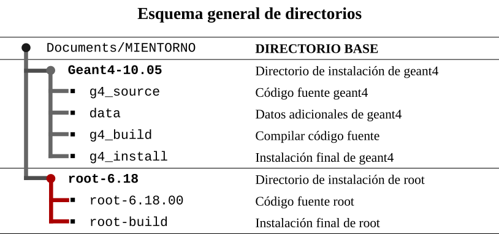
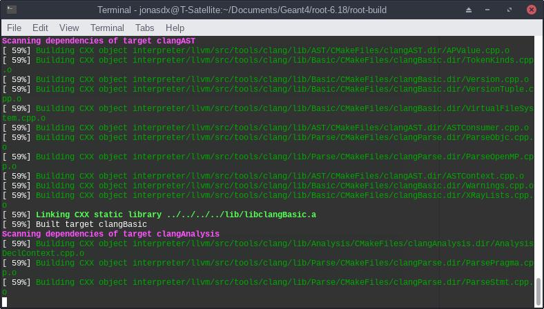

# Instalación de ROOT 6.18

Este proceso de instalación recomienda utilizar el *gestor de archivos* para moverse entre los distintos directorios. La instalación se realiza según el esquema que se muestra en el esquema (todos los directorios son carpetas). 

----




## Pasos a seguir:

1. ACTUALIZAR la distribución de Linux a la versión más reciente:

      ```bash
      $ sudo apt update
      ```

      ```bash
      $ sudo apt upgrade
      ```

2. INSTALAR DEPENDENCIAS

    La lista detallada se puede revisar aquí [ROOT](https://root.cern.ch/build-prerequisites). Los paquetes han sido cuidadosamente revisados de acuerdo a base de datos de paquetes de [Ubuntu/bionic](https://packages.ubuntu.com/)

   **Librerías necesarias (sin esto no funciona)**

   ```bash
	$ sudo apt install cmake cmake-qt-gui g++ gcc gfortran binutils libx11-dev libxpm-dev libxft-dev libxext-dev libpng-dev libpng++-dev libjpeg-dev
   ```
   
   Librerías importantes (opcionales)

   ```bash
	$ sudo apt install git libssl-dev libpcre3-dev libftgl-dev libmysqlclient-dev libfftw3-dev libcfitsio-dev graphviz-dev libavahi-compat-libdnssd-dev libldap2-dev python-dev libxml2-dev libkrb5-dev libgsl23 libgsl-dev
   ```
   
---

3. **Descargar** los binarios desde la página oficial de [ROOT](https://root.cern.ch/downloading-root) . Seleccionar la última versión estable (PRO). 

      [root_v6.18.00.source.tar.gz](https://root.cern/download/root_v6.18.00.source.tar.gz), (158 MB)

4. **Mover** el archivo descargado al directorio de instalación:

      ```bash
      /home/USUARIO/Documents/MIENTORNO/root-6.18/
      ```

5. **Descomprimir** el archivo *.tar.gz* para obtener una carpeta llamada: *root*. ¡Renombrar! ese directorio a ***root-6.18.00*** (para evitar problemas con los ficheros de Ubuntu)

   - renombrar: *root --- a ---> root-6.18.00*

6. Crear el directorio ***root-build***.

   >  Comprobar que los directorios esten de acuerdo al esquema.

7. Abrir una terminal y cambiar al directorio actual: ***root-build***

   ```bash
   $ cd /home/USUARIO/Documents/ENTORNO/root-6.18/root-build/
   ```

8. Ejecutar `cmake` (Prepara la compilación)

   ```bash
   $ camke ../root-6.18.00/
   ```

9. Compilar root

   Aquí `j4` significa que se compilará usando 4 núcleos del procesador,  depende de la potencia de tu ordenador.  Mientras más núcleos físicos poseas menos tiempo tomará el proceso y viceversa. 

   ```bash
   $ make -j4
   ```

   En mi caso, usando usando 4 núcleos el proceso tardó: 1h y 30 min.

   

10. Fijar las variables de entorno

   ```bash
   $ source /bin/thisroot.sh
   ```

11. Ya tenemos instalado ROOT. Ejecutar:

   ```bash
   $ root
   ```


## ROOT de forma persistente `(source)`

Con el proceso anterior ya se tiene correctamente instalado *ROOT*, sin embargo, es necesario que fijemos las variables de entorno cada cerremos la terminal. La solución es fijar *ROOT* de forma persistente.

El proceso es el siguiente:

   - Abrir el explorador de archivos en la siguiente ruta:

     ```bash
     /home/Usuario/
     ```

   - Presionar `Crtl + H` para ver los archivos ocultos.

   - Localizar el archivo `.bashrc`

   - Abrir `.bashrc` con un editor de texto, ir al final del todo y pegar lo siguiente:

     (Cambia USUARIO por el tuyo)

     ```bash
     # Entorno de Geant4 y ROOT
     source /home/USUARIO/Documents/MIENTORNO/root-6.18/root-build/bin/thisroot.sh
     ```

- Guardamos, salimos y presionar nuevamente `Crtl + H` para regresar todo a la normalidad.

* Ahora podemos ejecutar *root* desde cualquier parte del ordenador

   ```bash
   $ root
   ```


## Resultado

Se sabe que el programa ha sido compilado desde el código fuente, por el tag:

```bash
Built for linuxx8664gcc on Aug 25 2019.
From tag, 25 June 2019
```

​    


## Adicional

### Vincular *ROOT* con *Geant4* para simulaciones

Esto es especialmente útil cuando se requiere que la simulación llame a ROOT para llenar un histograma directamente, etc.  

El procedimiento es el siguiente:

1. Movernos a la ruta de instalación de root y crear un archivo nuevo llamado: `root.sh`, así:

   ```bash
   $ cd /home/user/Documents/MIENTORNO/root-6.18/
   $ touch script_root.sh
   ```

2. Abrir el archivo que hemos creado y pegar dentro lo siguiente:

   ```bash
   #Mensaje para mostrar en la terminal
   echo Root en Geant4 listo!
   
   #Para usar ROOT con Geant4 en algunas aplicaciones
   export G4ROOT_USE=1
   ```

3. Guardar el archivo y cerrar.

4. Hacer un **source** (persistente) del script en `.bashrc` como en el caso anterior.

   ```bash
   source /home/user/Documents/MIENTORNO/root-6.18/script_root.sh
   ```

5. Ejecutar root

   ```bash
   $ root
   ```


# Recursos:

- [Dependencias Root](https://root.cern.ch/build-prerequisites)
- [Paquetes Ubuntu](https://packages.ubuntu.com/)